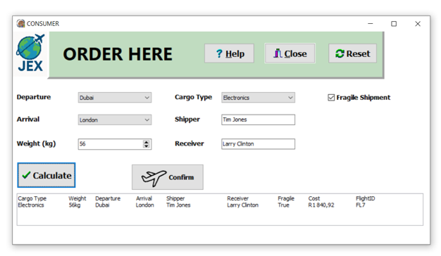
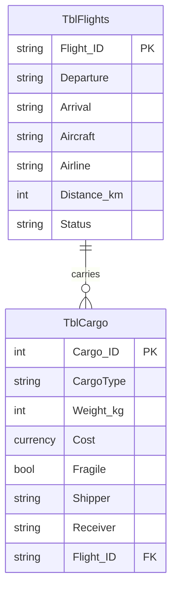

# Jean's Express — International Air Freight Management System

A desktop application for booking, costing and administering international air cargo shipments.
Built as my Grade 12 Information Technology Practical Assessment Task (PAT).

> **Project context** — South African NSC Grade 12 IT PAT, 2025. Roughly six months of work,
> ~1 600 lines of Object Pascal, worth 25% of the final subject mark. Awarded 99%, with distinction in subject. 
> The syllabus prescribed Delphi and Microsoft Access; the tech stack was not a design choice.
> The code is published as submitted, unmodified. My own critique of it is in
> [RETROSPECTIVE.md](RETROSPECTIVE.md).



---

## The problem

Air freight is the fastest way to move cargo across borders, but the booking experience is
less than optimal. Costs are quoted late, cargo restrictions surface after the fact, and a typo during
order capture propagates into an expensive mistake nobody catches until delivery.

The brief was to design and build a system that gives a customer full visibility of cost,
routing and cargo constraints **before** they commit to a booking, while giving an
administrator the tooling to manage the resulting records.

## What it does

**Consumer**
- Captures cargo type, weight, fragility, departure and arrival city
- Matches the route against available flights and returns the flight code and distance
- Calculates shipping cost from distance, weight, cargo class, fragility surcharge and tax,
  and shows the full breakdown before payment
- Writes a confirmed booking to the database and to a daily transaction file
- Order-status lookup by cargo ID
- FAQ and company information served from an external text file

**Administrator**
- Password-gated view over the full cargo database
- Sort, filter, select, edit and delete records
- Aggregate reporting: highest order value, average order value, fragile-shipment filter,
  orders placed today

## Architecture

Three forms, each owning one user role:

| Unit | Form | Responsibility |
|---|---|---|
| `Welcome_u.pas` | `TFrmWelcome` | Role selection and entry point |
| `Consumer_u.pas` | `TFrmConsumer` | Order capture, costing, confirmation, status lookup, FAQ |
| `Admin_u.pas` | `TFrmAdmin` | Database administration and reporting |

### Data model

Two Access tables in a one-to-many relationship — one flight carries many consignments.



### Flight lookup

Rather than resolving routes through a chain of conditionals, each route is a `TFlight`
object holding its own departure, arrival, flight code and distance:

```pascal
TFlight = class
private
  sDeparture: string;
  sArrival:   string;
  sFlight:    string;
  iDistance:  Integer;
public
  constructor Create(Departure, Arrival, Flight: string; Distance: Integer);
end;

const MAX_FLIGHTS = 20;
var   arrFlights: array[0..MAX_FLIGHTS - 1] of TFlight;
```

`LoadFlights` populates the array at form creation; `FindFlight` searches it for a matching
origin/destination pair and returns the flight code and distance to the costing routine.
Adding a route means adding one constructor call, not editing branching logic in several
places.

### Cost model

```
base      = distance × 0.1 + weight × 10
class     = base × 1.05          (high-value cargo)
fragile   = × 1.2                (fragile consignments)
tax       = × 0.15
total     = subtotal + tax
```

### File I/O

| File | Direction | Purpose |
|---|---|---|
| `About_Us.txt` | read | Company history and FAQ content, editable without recompiling |
| `Orders.txt` | read/write | Comma-delimited daily transaction log; written by the consumer flow, read back by the admin flow |

### Validation

Every user input is checked for errors before any calculation runs. A single `bValidate` boolean accumulates the
result across all field checks so the user sees every problem in one pass rather than being
walked through errors one at a time. Guards cover empty combo boxes, out-of-range weights,
identical origin and destination, non-existent cargo IDs and cost mismatches.

## Design decisions and trade-offs

| Decision | Reasoning | What it cost |
|---|---|---|
| `TFlight` class + array over nested conditionals | Routes become data, not control flow; adding a route is a one-line change | Fixed-capacity array; routes are compiled in rather than loaded from storage |
| Access database for records, flat file for the daily log | The daily log needed to be readable and writable by two separate flows without database locking | Two sources of truth for the same booking |
| Validation flag accumulated across all checks | User sees the full set of problems in one pass | Longer, more repetitive validation block |
| Cost breakdown shown before confirmation | The core problem being solved was cost opacity | Extra confirmation step in the flow |

## Known limitations

Documented honestly in [RETROSPECTIVE.md](RETROSPECTIVE.md) — hardcoded admin credentials,
business logic living inside UI event handlers, fixed-size storage, and no automated tests,
among others.

## Running it

This needs Delphi 2010  on Windows, with the Access
database in the application directory. Realistically, most people reading this will not have
that toolchain. The screenshots in [`docs/screenshots/`](docs/screenshots/) show every screen
and every output path, and the source in [`src/`](src/) is readable without running it.

## Repository map

```
├── src/                     Object Pascal source (.pas) and form definitions (.dfm)
├── data/                    Access database, About_Us.txt, sample Orders.txt
├── docs/
│   ├── phase-1-planning.pdf Original design document as submitted
│   ├── screenshots/         Every screen and output state
│   └── diagrams/            ER diagram, class diagram, navigation flow
├── RETROSPECTIVE.md         What I'd build differently now
└── README.md
```

## About this project

This was the first system I designed from start to finish, including; requirements, data model, class design,
interface, implementation and documentation. Six months of work in one final project. Delphi is not a language I intend to keep working in, but a beginning for: breaking an ambiguous problem into a data model, choosing
structures that make change cheap, and being able to explain why.

I'm currently a BSc student at North-West University, working toward machine learning
engineering. This is where the portfolio starts, not where it ends.
